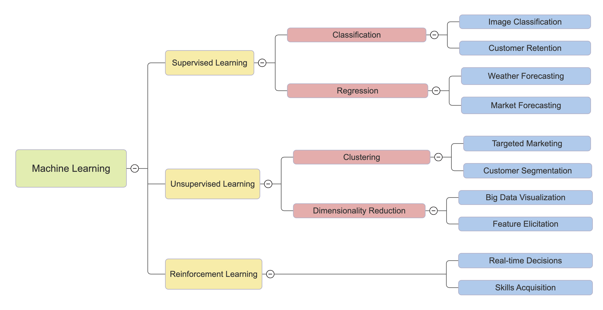

# Machine Learning

This repository provides an overview of the key concepts and techniques in **Machine Learning**. It covers both **Supervised** and **Unsupervised** learning methods with practical examples and explanations.

## Table of Contents

- [Introduction](#introduction)
- [Supervised Learning](#supervised-learning)
- [Unsupervised Learning](#unsupervised-learning)
- [Machine Learning Image](#machine-learning-image)

## Introduction

Machine Learning is a subset of artificial intelligence (AI) that enables systems to learn from data and make predictions or decisions without being explicitly programmed. It involves algorithms that can adapt and improve over time based on the data they process.

### Types of Machine Learning:

1. **Supervised Learning**: The model learns from labeled data and predicts outcomes based on input-output pairs.
2. **Unsupervised Learning**: The model learns from unlabeled data to identify patterns and structures in the data.

## Supervised Learning

Supervised learning algorithms are trained using labeled datasets, which means the input data is paired with the correct output. The goal is for the model to make predictions on new, unseen data based on what it has learned from the labeled data.

### Examples of Supervised Learning:

- **Linear Regression**
- **Decision Trees**
- **Support Vector Machines (SVM)**
- **Neural Networks**

## Unsupervised Learning

Unsupervised learning involves training a model on data that does not have labeled responses. The goal is to identify patterns, clusters, or relationships within the data.

### Examples of Unsupervised Learning:

- **K-Means Clustering**
- **Hierarchical Clustering**
- **Principal Component Analysis (PCA)**

## Machine Learning Image

Below is an image that represents key concepts in Machine Learning:

